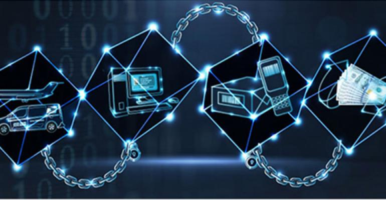

# 블록체인

## 블록체인

> &#x20;블록체인은 관리 데이터를 ‘블록’이라 하는 소규모 데이터들이 P2P 방식을 기반으로 생성된 체인 형태의 연결고리 기반 분산 데이터 저장환경에 저장되어 임의로 수정할 수 없고 누구나 변경의 결과를 열람할 수 있는 분산 컴퓨팅 기술의 원장 관리 기술을 말한다.”
>
> &#x20;이는 2008년에 발표된 Nakamoto Satoshi의 논문 \<Bitcoin: A peer-to-peer electronic cash system>에서 암호화폐인 비트코인(Bitcoin)의 이중지불을 방지하기 위한 데이터 기록 및 검증 기술로서 처음 제안되었다.

.jpg>)

## 토큰(암호화폐)


토큰이란 20세기 행동주의 학습이론가 Skinner가 제안한 Token Economy에서 나온 개념으로 게임 이론과 인센티브 제도를 기반으로 사람들의 바람직한 행동을 유도하는 시스템을 돕는 상징적 재화이다.

&#x20;토큰은 서비스나 제품과 교환할 수 있는 물체 또는 상징이라 할 수 있는데, 점토 동전의 형태의 토큰이 인류사회에 처음 나타났으며, 유목민 수렵 채집 사회에서 농업 사회로 전환기와 단순한 물물교환 경제에서 더 복잡한 경제 시스템에서 까지 나타난다.

&#x20;NFT 또한 블록체인 시스템에 적용되는 토큰의 일종이다. Non-fungible token에서의 ‘Token’은 크립토 경제의 커뮤니티, 시장 또는 자치 독립체가 정의한 가치 자산의 디지털 표현으로 non-fungible이나 fungible이 될 수 있는 지불단위, 보상, 거래 자산의 역할을 한다.


## 네트워크(체인)

## NFT

## 토큰 이코노미

## 온체인

## 오프체인

## 스마트 컨트랙트

## DAO

## Defi

## dAPP

## 거버넌스

## 탈중앙성

## 메타버스

&#x20;
